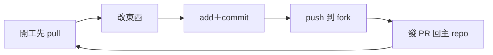
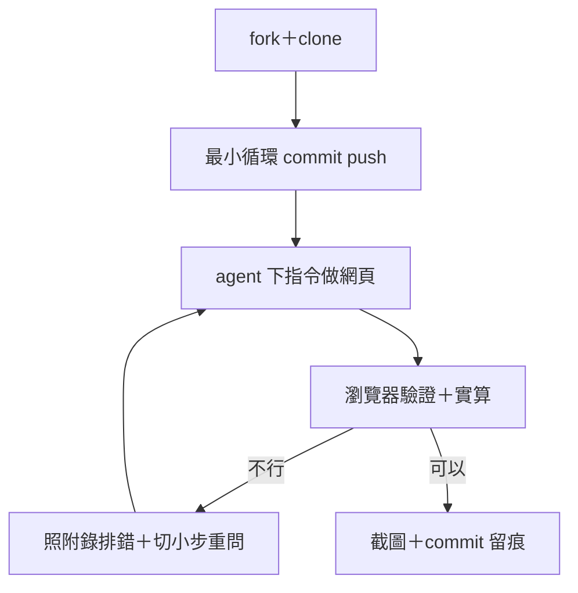

# 2026-09-19 GitHub＋Agent Coding（第一堂，個人制）

- 主題：GitHub 工作流＋Agent Coding 入門；不綁特定設計軟體，以網頁小工具為主
- 對象：coding 0 經驗、可能第一次用 GitHub／第一次叫 agent 寫程式
- 節奏：10:00–12:00 講座 → 12:00–15:00 黑克松 → 15:00–16:00 輪流簡報
- 本檔即簡報內容來源：每節對應投影片章節

## 課前準備

### 學生端

1. 帶筆電＋電源＋滑鼠（有就帶）
2. **開 GitHub 帳號**：免費註冊＋收驗證信開通（沒帳號後面全卡住）
3. **裝 Git**：`git config` 設好姓名與 email（對應 GitHub 帳號）
4. **Node.js LTS（20.x 以上）**：後面跑網頁小工具、部署用
5. **選一個 coding agent**（不限定）並裝好、登入：
   - Claude Code／VS Code（Copilot）／Gemini CLI／Antigravity／OpenCode
6. 課前不用預習程式，帶一個「想自動化的室設麻煩事」來（估價、排磚、燈具配置都可）

### 業師端

- [ ] 簡報＋投影＋示範機（Git＋Node＋至少一個 agent 全流程跑通）
- [ ] 主 repo `main` 開分支保護：禁直接 push，只能 PR 合併（10/3 起個人交付用）
- [ ] 課程聯絡管道（待定：LINE 群／Teams／信箱）
- [ ] 備用機一台：學生環境救不回時頂上
- [ ] 教室網路確認能抓 npm／Go module（或預先準備離線包）

## 課程內容

### Part 1｜GitHub＋coding agent 入門（講座前半）

對象是 0 經驗，以示範＋跟做為主，少用名詞。

- **概念**
  - repo／commit／push／issue／PR，用「全班共寫一份工具清單」的情境講；
    為什麼工具開發要版本控制
  - agent 是什麼：LLM 會「叫工具」→ 直接改檔案、跑指令、開 PR，
    室設從「手算手排」變成「講需求、驗結果」
  - **AI 協作三原則**：
    1. 給情境：跟 agent 講清楚專案、輸入、輸出長什麼樣，越具體越可靠
    2. agent 會錯：任何產出都要親自驗（跑起來看、尺寸重算一次），截圖就是證據
    3. 可追溯：改動都用 commit 進 repo；大改前先 commit 一次方便回滾
  - GitHub 在這門課的定位：版本控制＋協作＋agent 的「軌道」
- **跟做**：業師畫面示範，學生同步操作（個人制，每人獨立一條線）：
  1. `git config`；每人 fork 主 repo 到自己帳號，再 clone 到本機
  2. 改 README 一行 → commit → push 到自己的 fork（版本控制最小循環）
  3. **大檔案不進 repo**：`.rvt`／`.skp`／影片原檔留在本機；
     repo 只放程式、文件、截圖、匯出資料（JSON／CSV）
  4. 開一個 issue → 叫 agent 解掉並提 PR 回自己的 fork（issue → agent → PR 全流程，
     學生看流程，挑幾人上機試）
  5. **跟上游同步**：主 repo 更新時（老師加模板、改文件），到自己 fork 網頁按
     Sync fork → Update branch，再回本機 `git pull`
- **常用操作流程**：只教到發表會用到的
  - 起手式（只做一次）： fork 主 repo → `git clone <fork URL>` 到本機
  - 個人：開工 `pull` → 改 → `add＋commit` → `push`；有問題開 issue
  - 交件：從自己的 fork 發 PR 回主 repo；主 repo 更新就 Sync fork 再 pull
  - 卡住或衝突：先停手不要硬解，找業師

個人日常＋交件循環：

### Part 2｜Agent Coding：第一次從 prompt 到網頁（講座後半）

- **架構**：你講話 → agent 改檔案＋跑指令 → 瀏覽器驗收。不是聊天，是「需求→可跑的東西→驗證」
- **邊界與風險**：
  - 先從靜態網頁開始（HTML＋JS 單檔）：磁磚計算機、油漆用量、櫃體估價表都適合
  - 不要一次叫 agent 做太大：切小步、每步跑起來看
  - 授權注意：網路抓的圖、業主平面不要直接丟公開 repo
- **連線驗證＋排錯**：課前已裝好，課上是驗通＋救火
  1. 開 terminal：`node -v`、`git --version` 有反應
  2. 叫 agent：「幫我建一個 `hello.html`，打開顯示今天日期」→ 瀏覽器打開驗證
  3. 再叫一個：「加一個輸入坪數、輸出油漆公升數的計算機」→ 輸入 10 坪驗算一次
  4. 不順的人照附錄排；業師巡場
  5. 跑完的人直接開始 Part 3 任務

### Part 3｜實作：黑克松（3hr，個人）

- 目標：跑通個人 fork 流程、用 agent 做出第一個「能跑的」網頁雛形；不用漂亮，能算能看就好
- 步驟：
  1. fork＋clone 主 repo 到本機
  2. 最小循環：改 README 一行 → commit → push 到自己的 fork
  3. 使用：開 agent 下指令 → 瀏覽器驗證 → 截圖留底
- 題目（由低到高，做出來為止）：
  1. 單檔計算機：油漆用量／窗簾布尺／插座數量估算
  2. 表格工具：貼上 Excel 估價單，自動加總＋排序＋匯出 CSV
  3. 自由試：把早上帶來的「室設麻煩事」丟給 agent（驗證＋截圖，寫 10/3 作業用得到）

### Part 4｜簡報＋作業＋預告（1hr）

- 簡報：每人輪流講（每人 2–3 分鐘）：題目方向＋今天做出什麼＋最卡的地方
- **作業**：每人 10/3 前於自己的 fork 開一個 issue：
  - 標題＝想做的網頁小工具方向（不限定）
  - 內文＝輸入是什麼、輸出是什麼、誰會用
- **預告 10/3**：AI 基礎知識（素養／邊界／治理／資料分析四選，待定）＋繼續磨小工具；
  有興趣碰 Revit 的先確認電腦跑不跑得動 Revit 2024 學生版
- 收尾：公布課程聯絡管道

## 附錄：常見問題（課上隨查）

| 症狀 | 檢查 |
|------|------|
| `git push` 被拒 | fork 沒 sync 或分支保護擋直推 → Sync fork 後 pull 再推，交件一律走 PR |
| merge 衝突 | 先停手找業師；動手前先 pull＋Sync fork |
| agent 亂改檔案 | 大改前先 commit；叫 agent 前先講清楚「只動哪個檔、輸出長怎樣」 |
| `node -v` 沒反應 | Node 沒裝好或 terminal 沒重開；重裝 LTS 後重開 terminal |
| 網頁打開空白 | 檔名路徑錯／瀏覽器快取；F12 看 console 第一行紅字 |
| 不想公開業主圖 | 去識別化再放 repo；平面、地址、人名先馬賽克或假資料代替 |

