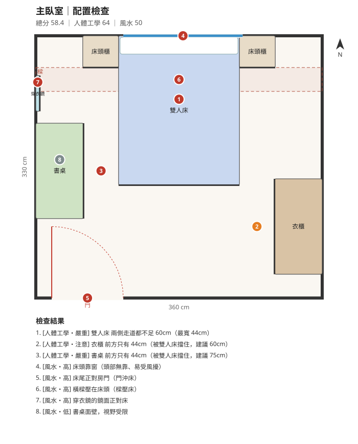
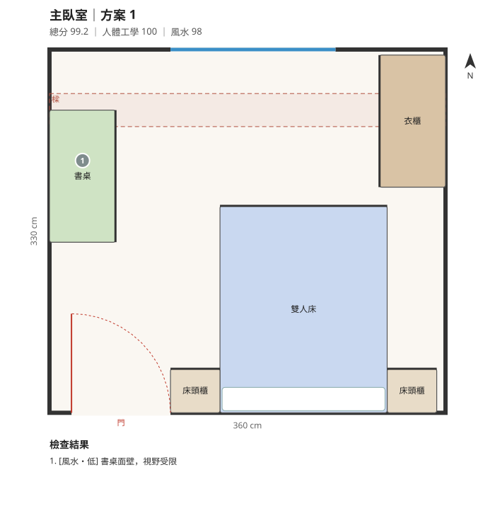

# A14530026 王品洋

- 課程：南應室設 115-1「設計運算與 AI 整合應用」
- 日期：2026-09-19（第一堂：GitHub＋Agent Coding 入門）

## 想自動化的室設麻煩事

家具配置常常要來回確認兩件事：**尺寸動線夠不夠**，以及業主在意的**風水禁忌**。每次都要手動量走道、看門窗和樑的位置，很花時間。

## 今日實作：`furniture-layout-fengshui` skill

一個 Claude Skill：輸入房間尺寸、門窗與樑的位置，就能自動檢查家具配置，並產生建議方案與平面圖。

- **人體工學檢查**：床邊走道、衣櫃與書桌前方的淨空、門片開啟範圍、高櫃擋窗、沙發到電視的距離；另外用網格路徑搜尋確認從房門走得到每件家具
- **風水檢查**：門沖床、樑壓床、床頭靠窗、鏡子照床、背門而坐、穿堂煞等 15 條規則，每條附上「傳統說法、實際理由、化解方式」
- **自動最佳化**：用隨機搜尋加爬山法找出高分配置，輸出 2 到 3 個方案的 SVG 平面圖

| 原本的配置（58.4 分） | 自動最佳化（99.2 分） |
|:---:|:---:|
|  |  |

詳細說明見 [furniture-layout-fengshui/README.md](furniture-layout-fengshui/README.md)。

## 今天做了什麼

- [x] 建立 GitHub 帳號、fork 主 repo
- [x] 在 `20260919/students/` 建立自己的 `A14530026_王品洋/` 資料夾
- [x] 開發 skill：規則文件＋Python 檢查與最佳化腳本
- [x] 用範例臥室、客廳實際執行，驗證結果並產生平面圖
- [x] 發 PR 回主 repo

## 最卡的地方

第一次使用 GitHub，不熟 fork 和 PR 的流程；另外，要把風水這種「經驗規則」轉成程式可以判斷的幾何條件，需要先想清楚每條規則的定義。
