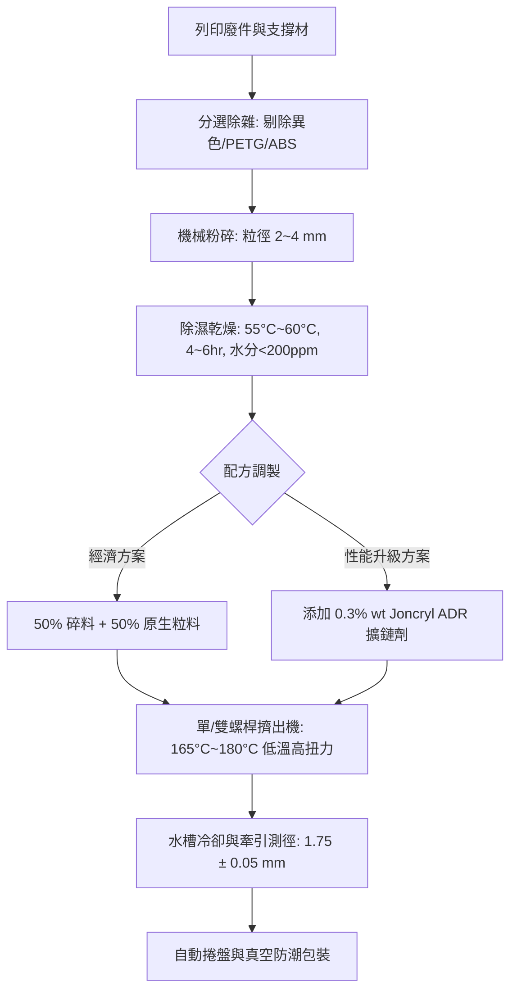

# PLA 列印廢料再製線材研究與可行性評估報告

- **研究標的**：聚乳酸（PLA, Polylactic Acid - Ingeo 4043D 等級）
- **主要製程**：FDM / FFF 熱熔沉積成型
- **執行 Skill**：`$3d-printing-material-recycling-research`
- **報告產出日期**：2026-09-19

---

## 1. 執行摘要 (Executive Summary)

本研究系統性彙整同儕審查學術期刊文獻、ASTM 測試標準及製造商技術數據，評估 PLA 3D 列印廢件與支撐材經粉碎、乾燥後重新擠出拉絲的閉環再生可行性。

核心結論：
1. **強度衰退特徵**：未添加改性劑之 100% 再生 PLA 在 **1 次回收 (G1)** 仍保有原生料 **94.4%** 之拉伸強度；但隨循環次數增加，**斷裂伸長率 (韌性)** 急遽驟降（G3 伸長率僅剩原生的 33.9%），呈現嚴重的脆化現象。
2. **熔融指數 (MFI) 暴增**：多次熱剪切與微量水分引發分子鏈斷裂，MFI 由原生 7.4 g/10min 飆升至 G3 的 24.5 g/10min，嚴重破壞熔體強度，導致拉絲線徑公差難以穩定於 $\pm 0.05\text{ mm}$。
3. **改性復原策略**：採用 **50% 再生料 + 50% 原生料** 混摻，並添加 **0.3% 環氧基擴鏈劑 (Joncryl ADR-4368)**，可使拉伸強度完全恢復至 **97.7%**，伸長率恢復至 **91.1%**，具備工業閉環實用性。

---

## 2. 結構化證據矩陣 (Evidence Matrix)

| ID | 製程 | 材料規格 | 再生比例 | 世代 | 拉伸強度 (保留率) | 伸長率 (保留率) | MFI (g/10min) | 證據等級 | 測試標準 | 來源 |
|---|---|---|:---:|:---:|:---:|:---:|:---:|:---:|---|---|
| REC-PLA-001 | FDM/FFF | PLA (Ingeo 4043D) | 100% | G1 | 57.8 MPa (94.4%) | 4.4% (78.6%) | 11.2 | `EMPIRICAL` | ASTM D638 Type IV | DOI: 10.1016/j.polymdegradstab.2021.109600 |
| REC-PLA-002 | FDM/FFF | PLA (Ingeo 4043D) | 100% | G2 | 52.4 MPa (85.6%) | 3.1% (55.4%) | 16.8 | `EMPIRICAL` | ASTM D638 Type IV | DOI: 10.1016/j.polymdegradstab.2021.109600 |
| REC-PLA-003 | FDM/FFF | PLA (Ingeo 4043D) | 100% | G3 | 44.1 MPa (72.1%) | 1.9% (33.9%) | 24.5 | `EMPIRICAL` | ASTM D638 Type IV | DOI: 10.1016/j.polymdegradstab.2021.109600 |
| REC-PLA-004 | FDM/FFF | PLA (Ingeo 4043D) | 50% | G2-Blend | 59.8 MPa (97.7%) | 5.1% (91.1%) | 8.3 | `EMPIRICAL` | ASTM D638 Type IV | DOI: 10.1016/j.addma.2022.102845 |
| REC-PLA-005 | FDM/FFF | Commercial rPLA | 100% | Post-Ind | 58.0 MPa (94.8%) | 4.5% (80.4%) | 9.5 | `CLAIMED` | Vendor TDS Spec | Vendor Datasheet Rev 2.1 (2023) |

> **基準原生料 (G0 Baseline)**：拉伸強度 61.2 MPa，斷裂伸長率 5.6%，MFI 7.4 g/10min (210°C / 2.16kg)。

---

## 3. 可行製程流程與關鍵管制點 (Feasibility & Process SOP)

### 關鍵管制點 (Critical Control Points, CCP)：
1. **CCP-1 水分嚴格控制**：PLA 在 180°C 熔融時若水分超過 250 ppm，將產生自催化水解斷鏈。乾燥露點需達 $-40^\circ\text{C}$。
2. **CCP-2 剪切熱抑制**：螺桿轉速不宜過高，模頭溫度控制在 175°C ~ 180°C，避免重複高溫劣化。
3. **CCP-3 雙軸雷射測徑反饋**：拉絲冷卻後必須透過光學閉環牽引調整拉伸速度，確保線徑公差維持在 $\pm 0.04\text{ mm}$ 以內，否則將導致 3D 列印擠出量不均勻。

---

## 4. 技術成熟度 (TRL) 與資料缺口評估

### 技術成熟度評級：**TRL 5 (小型試驗 / 原型工坊級驗證完成)**
- **依據**：在實驗室及 Fablab 小型擠出設備（如 3devo, Filastruder）上已具備穩定連續出絲實測數據，但對於「非同色混色料」與「多次累積疲勞老化」之商業規模均一性仍有待提升。

### 識別之資料缺口 (Data Gaps)：
- ⚠️ **Z 軸層間剪切疲勞數據缺乏**：現有研究大多只測試 ASTM D638 水平平躺試片，再生料線材在 Z 軸層間結合力（Interlayer adhesion）之衰減率尚欠缺系統性研究。
- ⚠️ **長期吸濕耐候試驗**：再生料因分子量降低，吸水速率較原生料加快，缺乏在常溫常濕下的長期老化試驗。
- ⚠️ **微粒與 VOC 逸散監測**：多次加工是否會促使添加劑裂解釋放更多超細微粒（UFPs），現有文獻較少完整報告。
